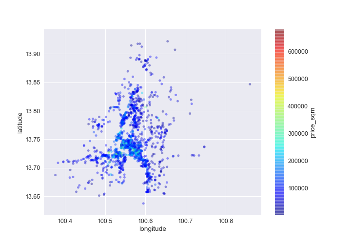
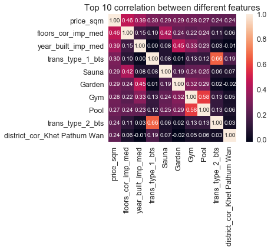
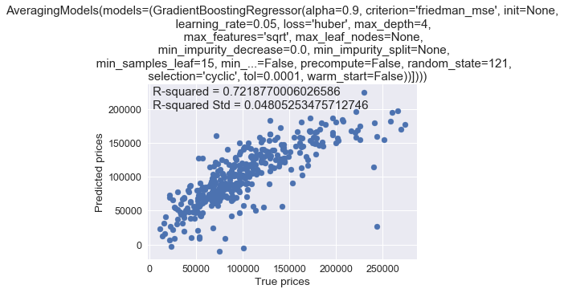

# Using multiple models to predict condominium price in Bangkok, Thailand.

# Steps:

- Load csv Pandas DataFrame containing condominium data retrieved by from the webscraper. The csv file can be download [here](https://github.com/ekapope/web-scraping-using-selenium-and-bs4/blob/master/df_hipflat_cleaned_01_gh.csv) from previous [webscraping project](https://github.com/ekapope/web-scraping-using-selenium-and-bs4).

- Perform some basic data exploration and visualization.

- Clean up and drop unused columns.

- Use pd.get_dummies() to convert catagorical data to columns.

- Define explanatory variables and independent variable (price_sqm in THB).

- Split the data in train and test set.

- Find the optimal model parameters for each model.

- Define a generic function for 10 folds cross-validation and evaluate estimator performance.

- Using make_pipeline, RobustScaler() for data scaling then pass to the regressor model.

- The benchmark is R-Square from 10-fold CV.

# Score Results:

1. Gradient Boosting regression - 0.7743

2. Neural network models: Multi-layer Perceptron (MLPRegressor) - 0.6647

3. K-Neighbors Regressor - 0.6183

4. Ridge Regression - 0.6130

5. Lasso Regression - 0.6126

6. Random forest regressor - 0.6122

7. Ordinary least squares regression - 0.6116

8. ElasticNet - 0.6116

9. Decision Trees - 0.5517

Averaged models score (from top 5) - 0.7219

Summary:

Even this dataset is quite small with lots of features and we can only predict the price per square meters for each condo. However, this study will be very useful for buyers, resellers, agents and even developers to justify the 'fair price' as a starting point based on the current actual market data.

Rooms for improvement:

We still did not use the price history data in this project which can be really useful to visualize the trends for each area (which area is growing rapidly, which area is reaching plateau stage).

In the scraping step, we should acquire all listings available in each condo, not only average price per sqm. This should increase numerous numbers of records and it would be very useful to estimate the price for every single room in the future.

Thanks to these people for inspiration:

[Weesper1985/Predict_real_estate_prices](https://github.com/Weesper1985/Predict_real_estate_prices)

[Eric Kim/Predicting House Prices with Machine Learning](https://www.kaggle.com/erick5/predicting-house-prices-with-machine-learning)

